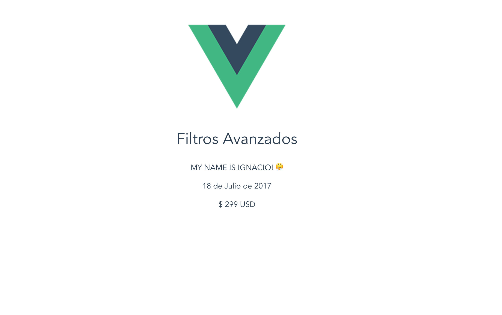

# Filtros Avanzado

## Instalación Local vs. Instalación Global.
En este material vamos a abarcar el concepto de filtros con un poco mas de profundidad.
Lo primero que vamos a ver es como podemos hacer que un filtro se instale de manera local, es decir que se aplique directamente a un componente especifico y no a toda la aplicación.

Para es lo que tenemos que hacer es registrar el filtro directamente en el componente. Vamos a crear un filtro nuevo, llamado `yell`, donde vamos a ejecutar el `toUpperCase()` para imprimir un `String` en mayusculas y simular que estamos gritando. Eso podemos hacerlo con el siguiente código:

```javascript
  // Este código pertenece al siguiente archivo ➡️ filters/yell.js

  const yellFilter = function (value) {
    if (typeof value !== 'string') { return '' }

    return `${value.toUpperCase()}! 😤`
  }

  export default yellFilter
```

Lo que debemos hacer ahora es importarlo en el componente donde queremos utilizarlo. Recuerden que para la instalación global de los filtros incluíamos el filtro dentro del archivo `main.js` y lo registrábamos con el método `Vue.use(filter)`. En este caso como la instalación del filtro es a nivel de componente no necesitamos usar ese método, lo único que tenemos que hacer es inyectarlo dentro del objeto `filters` del componente en cuestión.

Por otro lado en la instalación global creamos un objeto con la función `install` y dentro de esta definimos el filtro. En el caso de la instalación local el proceso es mas sencillo, simplemente necesitamos crear un archivo nuevo y definir dentro la función con el filtro para luego exportarla (ver el ejemplo de arriba).

```html
// Este código pertenece al siguiente archivo ➡️ App.vue
<template lang="pug">
  #app
    div
      p {{ msg | yell }}
</template>

<script>
import yell from './filters/yell'

export default {
  name: 'app',

  filters: { yell },

  data () {
    return {
      msg: 'My name is Ignacio'
    }
  }
}
</script>
```

> Mas allá de usar instalación local o global al momento de utilizar los filtros en los templates, siempre lo hacemos de la misma manera.

Como pueden ver es muy similar a lo que hacemos cuando queremos insertar un componente hijo dentro de un componente padre (también de manera local). Y esta es otra de las ventajas que tiene el framework, siempre que es posible utiliza los mismos patrones y estándares en las implementaciones.
Las instalaciones locales son aplicadas directamente en los componentes importando el archivo (componente, filtro, directiva, etc) y declarándolo en la propiedad correspondiente (components, filters, directives, etc.) . Como vamos a ver mas adelante esta misma metodología se aplica perfectamente a la hora de instalar directivas locales.

## Ejemplos Comunes de Filtros

### Fecha
Uno de los casos mas comunes es darle un formato mas amigable a un objeto de tipo de `Date`, para eso podemos hacer algo sencillo como esto:

```javascript
const dateFilter = function (date) {
  const months = [
    'Enero', 'Febrero', 'Marzo',
    'Abril', 'Mayo', 'Junio', 'Julio',
    'Agosto', 'Septiembre', 'Octubre',
    'Noviembre', 'Diciembre'
  ]

  const day = date.getDate()
  const monthIndex = date.getMonth()
  const year = date.getFullYear()

  return `${day} de ${months[monthIndex]} de ${year}`}`
}

export default dateFilter
```

> Para manipular fechas en javascript les recomiendo la librería [MomentJS](https://momentjs.com/) y su [plugin para Vue.js](https://github.com/brockpetrie/vue-moment)

### Moneda
Otro caso típico y sencillo seria el de dar formato de moneda a un valor de tipo `Number`, este caso podemos representarlo a través de este ejemplo.

```javascript
const currencyFilter = function (amount) {
  return `$ ${amount}`
}

export default currencyFilter
```

## Filtros con Argumentos

Otro concepto importante es que usando filtros también podemos enviar argumentos a la hora de transformar el valor. Vamos a utilizar el filtro `currency` que creamos anteriormente pero esta vez vamos a enviar con un argumento el tipo de moneda que queremos mostrar.

```javascript
// Este código pertenece al siguiente archivo ➡️ filters/currency.js

const currencyFilter = function (amount, type) {
  return `$ ${amount} ${type}`
}

export default currencyFilter
```

```html
// Este código pertenece al siguiente archivo ➡️ App.vue
<template lang="pug">
  #app
    div
      p {{ amount | currency('USD') }}
</template>

<script>
import currency from './filters/currency'

export default {
  name: 'app',

  filters: { currency },

  data () {
    return {
      amount: 299
    }
  }
}
</script>
```

## Filtros en `v-bind`

Los filtres pueden y deben ser utilizados dentro de expresiones pero también pueden utilizarse (de la misma manera) en la directiva `v-bind`.

```html
// Este código pertenece al siguiente archivo ➡️ App.vue
<template lang="pug">
  #app
    a(v-bind:alt="amount | currency('USD')") Link
</template>

<script>
import currency from './filters/currency'

export default {
  name: 'app',

  filters: { currency },

  data () {
    return {
      amount: 299
    }
  }
}
</script>
```

Tomando como ejemplo el filtro `currency` que creamos anteriormente podemos ver como aplicarlo a una propiedad (en este caso `alt` de un `a`) usando la directiva `v-bind`.

---
**Terminamos de ver todos los conceptos mas avanzados sobre filtros, en este [link](https://github.com/platzi/curso-vue-ejemplos/tree/filters) vas a poder ver el código totalmente funcional con todos los ejemplos que vimos en este material.**


